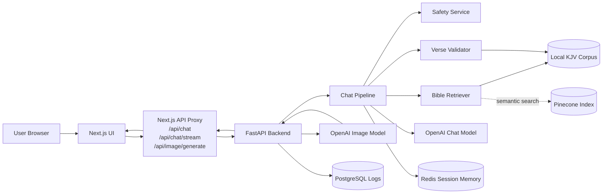
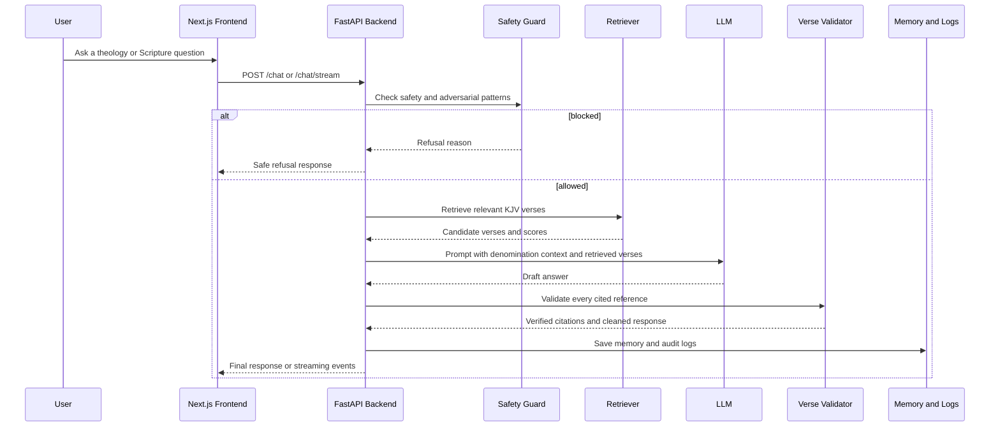

# ScriptureGuard AI

ScriptureGuard AI is a Christianity-focused AI assistant that answers theology and Scripture questions with verified KJV citations, supports denomination-aware responses, generates guarded Christian image prompts, and keeps session memory for ongoing conversations.

The core product is the grounding and safety pipeline: every cited Bible verse is checked against the local KJV corpus before it is shown to the user.

## Features

- Verified KJV citations from a local Bible corpus
- Denomination lenses: Protestant, Catholic, Orthodox, Evangelical, and Non-denominational
- Streaming chat responses over Server-Sent Events
- Guarded Christian image generation with safety checks
- Session memory with Redis fallback behavior
- PostgreSQL conversation logging
- Pinecone-backed retrieval with local fallback retrieval
- Multi-layer safety handling for unsafe, adversarial, or off-topic prompts
- Production-style Next.js standalone build support
- Docker Compose setup for frontend, backend, Redis, and PostgreSQL
- Backend tests and evaluation dataset for assignment verification

## Tech Stack

This project uses current LTS-compatible runtime choices for the stack used here:

| Area | Technology |
| --- | --- |
| Frontend | Next.js 15, React 19, TypeScript, Tailwind CSS v4 |
| Backend | FastAPI, Python 3.11 |
| LLM | OpenAI GPT model configured by `OPENAI_MODEL` |
| Image generation | OpenAI image model configured by `DALLE_MODEL` |
| Embeddings | `text-embedding-3-small` by default |
| Vector search | Pinecone |
| Memory | Redis |
| Logs | PostgreSQL with SQLAlchemy async |
| Local orchestration | Docker Compose |

## Architecture

The app is split into a Next.js frontend, a FastAPI backend, and supporting infrastructure for memory, logging, retrieval, and model calls. The browser talks to the Next.js API proxy first, then the proxy calls the backend. This keeps browser requests same-origin and avoids CORS problems during local production testing.



### Chat Pipeline



## Development Tradeoffs

| Decision | Tradeoff | Why this project uses it |
| --- | --- | --- |
| Local KJV corpus as citation source of truth | Limits citation validation to one public-domain translation | Guarantees cited verses can be verified locally and avoids licensing issues with modern translations |
| Pinecone plus local fallback retrieval | Adds an external dependency, but local fallback is less semantically strong | Gives production-style vector retrieval while keeping the app testable when Pinecone is unavailable |
| Next.js API proxy in front of FastAPI | Adds an extra hop between browser and backend | Prevents local CORS friction and keeps frontend calls same-origin in development and production-style runs |
| Server-Sent Events for chat streaming | One-way stream only, less flexible than WebSockets | Fits token streaming well, is simple to debug with `curl -N`, and avoids unnecessary WebSocket state |
| FastAPI for backend | Requires a separate frontend/backend runtime | Keeps the safety, retrieval, validation, and model pipeline strongly typed and easy to test independently |
| Redis for session memory | Memory is operationally separate from the app process | Keeps conversation context fast and disposable without coupling it to long-term audit logs |
| PostgreSQL for conversation logs | More setup than file logging | Gives durable audit data for evals, debugging, and future analytics |
| Denomination prompts as rendered natural language | Less compact than raw metadata injection | Prevents internal metadata leaks like `canon=`, `notes=`, or `distinctives=` in final responses |
| Guarded image generation instead of direct image calls | Adds safety checks and longer request time | Keeps image generation aligned with Christian-themed constraints and reduces unsafe prompt risk |
| Next.js standalone production start script | Requires copying static assets before local standalone startup | Preserves Docker-style standalone output while fixing local CSS and JavaScript asset serving |

## Repository Structure

```text
.
├── backend/
│   ├── app/
│   │   ├── routers/          # FastAPI routes
│   │   ├── services/         # LLM, retrieval, memory, image, safety, validation
│   │   ├── pipelines/        # Chat pipeline orchestration
│   │   ├── models/           # Pydantic and database models
│   │   ├── data/             # Local KJV Bible corpus and metadata
│   │   └── evals/            # Evaluation dataset and runner
│   ├── tests/
│   └── pyproject.toml
├── frontend/
│   ├── src/app/              # Next.js App Router pages and API proxies
│   ├── src/components/       # UI components
│   ├── src/lib/              # API client and hooks
│   └── package.json
├── docker-compose.yml
├── .env.example
└── Readme.md
```

## Prerequisites

- Node.js 24 LTS
- Python 3.11
- Docker and Docker Compose
- OpenAI API key
- Pinecone API key and index if you want managed vector retrieval

The app can still use local fallback retrieval when Pinecone is unavailable, but OpenAI is required for full LLM and image generation behavior.

## Environment Setup

Create a local environment file:

```bash
cp .env.example .env
```

Update `.env` with your own keys and local settings:

```env
OPENAI_API_KEY=sk-...
PINECONE_API_KEY=...
PINECONE_INDEX_NAME=bible-kjv
SECRET_KEY=replace-this-for-real-use
```

Do not commit `.env`. It is intentionally ignored by git.

### Important Environment Variables

| Variable | Purpose |
| --- | --- |
| `OPENAI_API_KEY` | Required for chat, moderation, embeddings, and image generation |
| `OPENAI_MODEL` | Chat model, defaults to `gpt-4o` |
| `OPENAI_EMBEDDING_MODEL` | Embedding model, defaults to `text-embedding-3-small` |
| `DALLE_MODEL` | Image model, defaults to `gpt-image-2-2026-04-21` |
| `PINECONE_API_KEY` | Enables Pinecone retrieval |
| `PINECONE_INDEX_NAME` | Pinecone index name, defaults to `bible-kjv` |
| `REDIS_URL` | Redis memory connection URL |
| `DATABASE_URL` | PostgreSQL async connection URL |
| `CORS_ORIGINS` | Allowed browser origins for backend CORS |
| `BACKEND_API_URL` | Backend URL used by Next.js API proxy |
| `BACKEND_REQUEST_TIMEOUT_MS` | Frontend proxy timeout for chat |
| `IMAGE_BACKEND_REQUEST_TIMEOUT_MS` | Frontend proxy timeout for image generation |

## Run With Docker Compose

The simplest full-stack startup is:

```bash
docker compose up --build
```

Then open:

- Frontend: `http://localhost:3000`
- Backend: `http://localhost:8000`
- Health: `http://localhost:8000/health`
- Readiness: `http://localhost:8000/ready`

Stop the stack with:

```bash
docker compose down
```

## Run Locally Without Docker

Start Redis and PostgreSQL locally, or keep those services running through Docker Compose.

### Backend

```bash
cd backend
python3.11 -m venv .venv
source .venv/bin/activate
pip install -e ".[dev]"
uvicorn app.main:app --host 127.0.0.1 --port 8000 --reload
```

### Frontend

```bash
cd frontend
npm install
npm run dev
```

Open `http://localhost:3000`.

## Production Build Check

The frontend uses Next.js standalone output. For local production testing, use the custom standalone start script so static assets are copied into the standalone server directory.

```bash
cd frontend
npm run build
PORT=3000 npm run start:standalone
```

Verify the UI at:

```text
http://localhost:3000
```

The standalone script copies:

- `.next/static` to `.next/standalone/.next/static`
- `public` to `.next/standalone/public`

This prevents missing CSS and JavaScript chunks during local production testing.

## API Overview

Backend routes are served from `http://localhost:8000`. The frontend also exposes proxy routes under `http://localhost:3000/api` to avoid browser CORS issues.

### Health

```bash
curl http://localhost:8000/health
curl http://localhost:8000/ready
```

### Chat

```bash
curl http://localhost:8000/chat \
  -H "Content-Type: application/json" \
  --data-raw '{
    "session_id": "49a1b182-ccf4-466b-be6a-c0e30a5b4303",
    "message": "What does John 3:16 teach? Please cite the verse.",
    "denomination": "protestant",
    "mode": "text"
  }'
```

### Streaming Chat

Use `curl -N` so Server-Sent Events are printed as they arrive:

```bash
curl -N http://localhost:3000/api/chat/stream \
  -H "Content-Type: application/json" \
  --data-raw '{
    "session_id": "49a1b182-ccf4-466b-be6a-c0e30a5b4303",
    "message": "What happens to believers after death?",
    "denomination": "non_denominational",
    "mode": "text"
  }'
```

The stream emits events such as:

- `status`
- `delta`
- `final`
- `error`

Some blocked, invalid-reference, or fallback responses may emit only `status` and `final`.

### Image Generation

```bash
curl http://localhost:8000/image/generate \
  -H "Content-Type: application/json" \
  --data-raw '{
    "session_id": "49a1b182-ccf4-466b-be6a-c0e30a5b4303",
    "prompt": "Jesus teaching beside the Sea of Galilee",
    "denomination": "protestant",
    "style": "classical painting"
  }'
```

Image generation can take longer than chat. The frontend shows a loader while the backend waits for the OpenAI image response.

## Denomination Behavior

Each response is shaped by the selected lens:

- Protestant: emphasizes Scripture and faith-alone framing where relevant
- Catholic: includes Scripture and Tradition framing, and purgatory for afterlife or sin topics where relevant
- Orthodox: uses Holy Tradition, theosis, and more mystical language where relevant
- Evangelical: emphasizes personal born-again conversion and assurance through accepting Jesus
- Non-denominational: keeps answers scripture-driven and avoids denomination-specific terminology

Internal denomination metadata must never appear in final API output. Responses should not expose raw values such as `canon=`, `notes=`, or `distinctives=`.

## Bible Grounding

The local KJV corpus is the source of truth for citations. The backend validates cited references against:

- `backend/app/data/bible_kjv.json`
- `backend/app/data/bible_metadata.json`

If a verse reference does not exist, it should not be presented as verified. This is especially important for adversarial prompts such as invalid references.

## Tests

Run backend tests:

```bash
cd backend
source .venv/bin/activate
pytest
```

Run frontend build verification:

```bash
cd frontend
npm run build
```

## Evaluations

The assignment evaluation dataset is stored at:

```text
backend/app/evals/eval_dataset.json
```

Run the eval runner from the backend directory:

```bash
cd backend
source .venv/bin/activate
python app/evals/run_evals.py
```

Use evals to check citation grounding, safety behavior, denomination differences, invalid Bible references, and sensitive theology responses.

## Development Notes

- Use the frontend `/api/*` proxy routes from the browser to avoid CORS issues.
- Use `http://127.0.0.1:8000` or `http://localhost:8000` directly for backend-only curl checks.
- Keep `.env` local and never commit secrets.
- Pinecone failures should not prevent basic local testing when local fallbacks are enabled.
- Redis or PostgreSQL connection issues may degrade memory or logging but should not block all local chat behavior.
- The production frontend must be started with `npm run start:standalone` after `npm run build`.

## Troubleshooting

### Frontend loads without Tailwind styling

Rebuild and start with the standalone script:

```bash
cd frontend
npm run build
PORT=3000 npm run start:standalone
```

Do not run the standalone server manually without copying `.next/static` and `public`.

### Browser shows CORS errors

Use the frontend proxy routes:

```text
http://localhost:3000/api/chat/stream
http://localhost:3000/api/image/generate
```

Also confirm `CORS_ORIGINS` includes the frontend origin you are using, such as `http://localhost:3000` and `http://127.0.0.1:3000`.

### Streaming returns `200 OK` but no visible chunks

Use:

```bash
curl -N http://localhost:3000/api/chat/stream ...
```

Without `-N`, curl may buffer the stream output.

### Image generation times out

Image generation can be slow. Confirm these values are high enough:

```env
IMAGE_GENERATION_TIMEOUT_SECONDS=300
IMAGE_BACKEND_REQUEST_TIMEOUT_MS=420000
```

Also confirm the configured OpenAI image model is available to your API key.

### Pinecone index warnings

If Pinecone is configured but the `bible-kjv` index does not exist, create the index or rely on local fallback retrieval during development.

## Quality Gates

Before handing off or pushing a production-quality change, run:

```bash
cd backend
pytest
```

```bash
cd frontend
npm run build
```

Recommended manual checks:

- Ask: `What does John 3:16 teach? Please cite the verse.`
- Ask: `Quote me Ezekiel 48:99`
- Ask: `What happens to believers after death?` across all denomination lenses
- Generate a safe Christian image prompt
- Confirm no final answer leaks raw denomination metadata

## License and Data

The local Bible grounding data uses the King James Version corpus because it is public domain. Confirm licensing before adding other Bible translations or copyrighted commentary.
